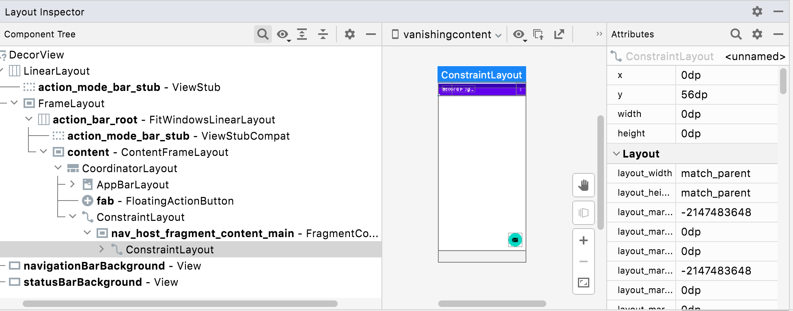
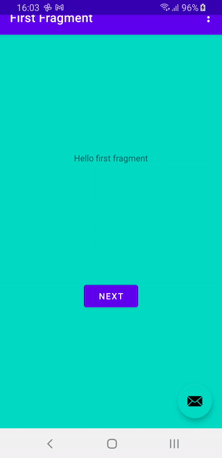

# VanishingContent
A test app to show weird issue with screen content disappearing

This is just the Android Studio New Project -> Basic Activity tweaked to have a shared element transition between
`FirstFragment` and `SecondFragment`. It also has `isAppearanceLightStatusBar` set via the `WindowInsetsControllerCompat` and
also `setOnApplyWindowInsetsListener` via `ViewCompat` where it updates the insets based on `ime() or navigationBars()`.

All of these things together on API 28 cause the content of the fragment to vanish, while working find on API 29. If you avoid
any one of the things, it also works fine, but shared element transition + `isAppearanceLightStatusBar` + updating insets always causes
the problem. Very odd.

If you use the Layout Inspector, the layout that's vanished has 0 for width/height:

You trigger the issue in the sample app by returning from the second screen to the first via the Back button, which sets `isAppearanceLightStatusBars = true`. Then pressing the NEXT button to return to the second screen makes the content vanish.

Here's an animation of what happens:

